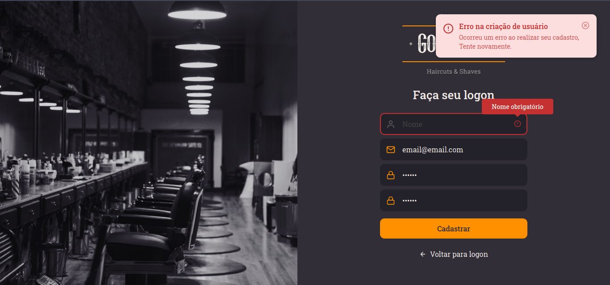

# Go Barber
  Is a simple barber shop app with the fetures below. STILL IN PROGRESS

## Features on the project:
  - Full authentication with JWT
  - Avatar image upload
  - Full CRUD functionality

### Preview

  

### Main technologies used:

  - FrontEnd:
    - Styled-Components
    - Context-Api
    - React-Router-Dom
    - Axios
    - Typescript

  - BackEnd:
    - Typescript
    - Cors
    - Typeorm
    - Postgresql
    - Multer

### Credits
  Go-Barber is an application I made following the GoStack bootcamp provided by [Rocketseat](https://github.com/Rocketseat).
  
